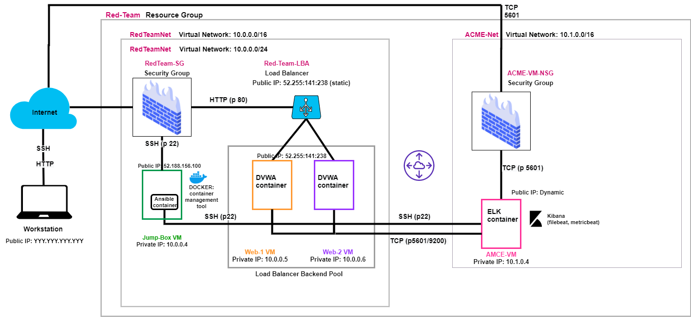

## Automated ELK Stack Deployment

The files in this repository were used to configure the network depicted below.

These files have been tested and used to generate a live ELK deployment on Azure. They can be used to either recreate the entire deployment pictured above. Alternatively, select portions of the __playbook__ file may be used to install only certain pieces of it, such as Filebeat.

  -  https://github.com/VbehrensN/ELK_STACK_PROJECT.git

This document contains the following details:
- Description of the Topology
- Access Policies
- ELK Configuration
  - Beats in Use
  - Machines Being Monitored
- How to Use the Ansible Build

### Description of the Topology

The main purpose of this network is to expose a load-balanced and monitored instance of DVWA, the D*mn Vulnerable Web Application.

Load balancing ensures that the application will be highly __available__, in addition to restricting __traffic__ to the network.

- Load balancers protect the availability of a service by providing access to more than one server so if a server does down, the other one is available and provides redundancy to the system.

- The advantage of jump box is that it protects the other machines in it's virtual netowrk because it sits infront of the other machines, i.e. it is the only machine that has public internet connection. It controls access to the other machines by allowing connections from specific IP addresses and forwarding to those machines

Integrating an ELK server allows users to easily monitor the vulnerable VMs for changes to the __data__ and system __logs__.
- Filebeat watches for log data (files and location).
- Metricbeat collects server system metrics such as CPU and memory usage, network information.

The configuration details of each machine may be found below.

| Name      | Function   | IP Address | Operating System |
|-----------|------------|------------|------------------|
| Jump Box  | Gateway    | 10.0.0.4   | Linux            |
| Web-1     | web server | 10.0.0.5   | Linux            |
| Web-2     | web server | 10.0.0.6   | Linus            |
| ACME-VM   | elk server | 10.1.0.4   | Linux            |

 

### Access Policies

The machines on the internal network are not exposed to the public Internet. 

Only the __jump box__ machine can accept connections from the Internet. Access to this machine is only allowed from the following IP addresses:
- __My public IP address__

Machines within the network can only be accessed by __loadbalancer__.
- The ELK VM can be accessed via my workstation via TCP (port 5601).
- The public IP address of the ELK VM is __dynamic__. 

 

A summary of the access policies in place can be found in the table below.

| Name     | Publicly Accessible | Allowed IP Addresses                 |
|----------|---------------------|--------------------------------------|
| Jump Box | No                  | My_public_IP_address on port 80      |
| Web-1    | Yes                 | Any port 80                          |
| Web-2    | Yes                 | Any port 80                          |
| AMCE-VM  | No                  | My_public_IP_address on TCP port 5601|

 

### Elk Configuration

Ansible was used to automate configuration of the ELK machine. No configuration was performed manually, which is advantageous because...

- The main advantage of automating configuration with Ansible is that many machines can be configured at once.

The playbook ["install-elk"](Ansible/install-elk.yml) implements the following tasks:
 

- install docker.io
- install python3-pip
- install docker module
- increase virtual memory
- use more memory
- download and launch docker elk container

The following screenshot displays the result of running `docker ps` after successfully configuring the ELK instance. 

### Target Machines & Beats
This ELK server is configured to monitor the following machines:
- __Web-1 10.0.0.5__ and
__Web-2 10.0.0.6__

We have installed the following Beats on these machines:
- __filebeat__ and __metricbeat__

These Beats allow us to collect the following information from each machine:
- Filebeat is used for logs events and Metricbeat is used for metrics such as CPU and memory usage, network information.

 

### Using the Playbook
In order to use the playbook, you will need to have an Ansible control node already configured. Assuming you have such a control node provisioned: 

SSH into the control node and follow the steps below:
- Copy the __/etc/ansible/files/filebeat-config.yml__ file to __/etc/filebeat/filebeat.yml__.
- Update the __configuration__ file to include __ELK server ip address and port, username, password__
- Run the playbook using the following command (ansible-playbook filebeat-playbook.ylm), and navigate to __ELK server GUI__ to check that the installation worked as expected.

 

The filebeat playbook can be found here: ["filebeat"](Ansible/filebeat-playbook.yml)

The metricbeat playbook can be found here: ["metricbeat"](Ansible/metricbeat-playbook.yml)

__These playbook files are copied to the jumpbox ansible container at location: /etc/ansible/roles #__

- Which file do you update to make Ansible run the playbook on a specific machine? 
__In the playbook file, there is a host item that needs to be updated to reflect which machine is to be configured.__

- How do I specify which machine to install the ELK server on versus which to install Filebeat on?_
__The machine IP address along with the GROUP name is specified in the 'hosts' file located in the jumpbox container /etc/ansible directory.__

- Which URL do you navigate to in order to check that the ELK server is running?  __http://[your.ELK-VM.External.IP]:5601/app/kibana__

_As a **Bonus**, provide the specific commands the user will need to run to download the playbook, update the files, etc._

